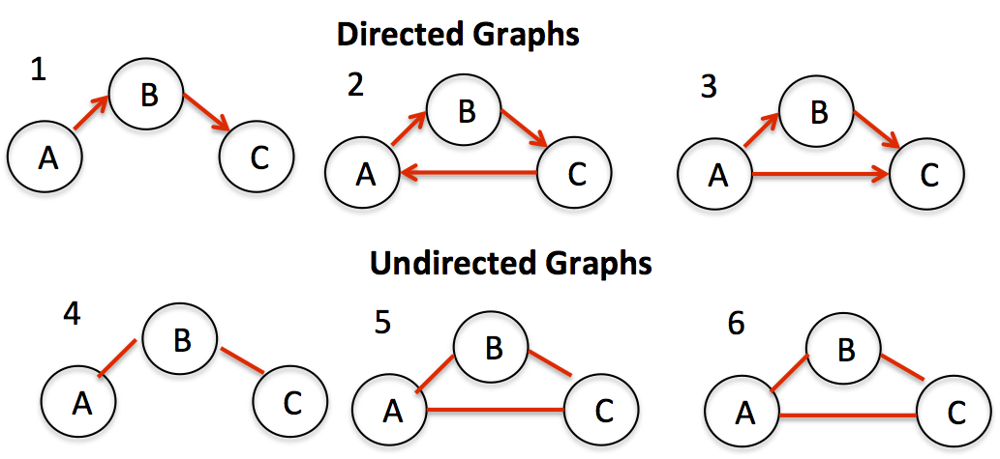
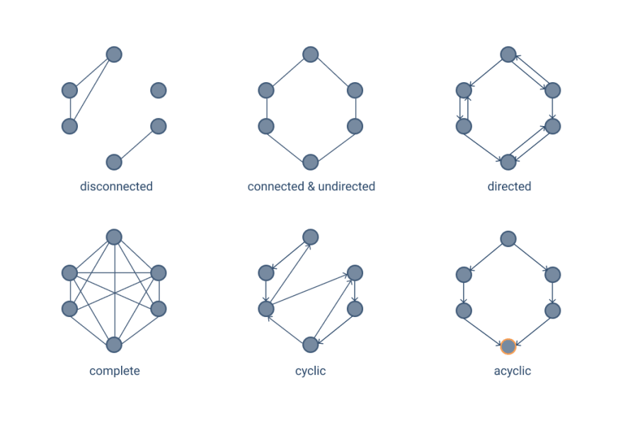
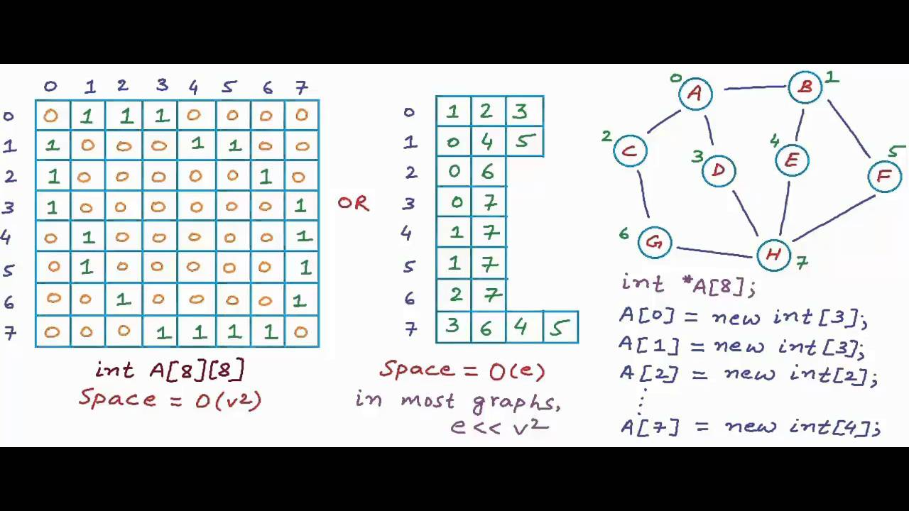
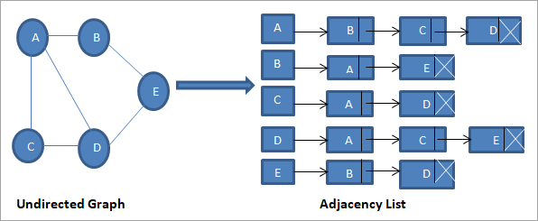

# Graph
## What is a Graph?
A graph is a non-linear data structure that can be looked at as a collection of vertices (or nodes) potentially connected by line segments named edges.

---

## Graph terminologies:
+ Vertex - A vertex, also called a “node”, is a data object that can have zero or more adjacent vertices.
+ Edge - An edge is a connection between two nodes.
+ Neighbor - The neighbors of a node are its adjacent nodes, i.e., are connected via an edge.
+ Degree - The degree of a vertex is the number of edges connected to that vertex.

---

## Directed Graphs (Digraph)
A Directed Graph also called a Digraph is a graph where every edge is directed.

Unlike an undirected graph, a Digraph has direction. Each node is directed at another node with a specific requirement of what node should be referenced next.

## Undirected Graphs
An Undirected Graph is a graph where each edge is undirected or bi-directional. This means that the undirected graph does not move in any direction.

---

### Directed vs Undirected
Compare the visual below with the undirected graph above. Can you see the difference? The Digraph has arrows pointing to specific nodes.

---

## Complete, Connected, Disconnected, Acyclic and Cyclic

+ Complete Graphs: A complete graph is when all nodes are connected to all other nodes.
+ Connected: A connected graph is graph that has all of vertices/nodes have at least one edge. A Tree is a form of a connected graph.
+ Disconnected: A disconnected graph is a graph where some vertices may not have edges.
+ Acyclic: An acyclic graph is a directed graph without cycles. A cycle is when a node can be traversed through and potentially end up back at itself. A directed acyclic graph is also called a DAG. This can also be represented as what we know as a tree.
+ Cyclic: A Cyclic graph is a graph that has cycles. A cycle is defined as a path of a positive length that starts and ends at the same vertex.

---

## Graph Representation
We represent graphs through:

+ Adjacency Matrix: An Adjacency matrix is represented through a 2-dimensional array. If there are n vertices, then we are looking at an n x n Boolean matrix. Each Row and column represents each vertex of the data structure. The elements of both the column and the row must add up to 1 if there is an edge that connects the two, or zero if there isn’t a connection.

	

+ Adjacency List: An adjacency list is the most common way to represent graphs. An adjacency list is a collection of linked lists or array that lists all of the other vertices that are connected. Adjacency lists make it easy to view if one vertices connects to another.

	
	

**Note:** to view the whole documentation, click [here](https://codefellows.github.io/common_curriculum/data_structures_and_algorithms/Code_401/class-35/resources/graphs.html).

