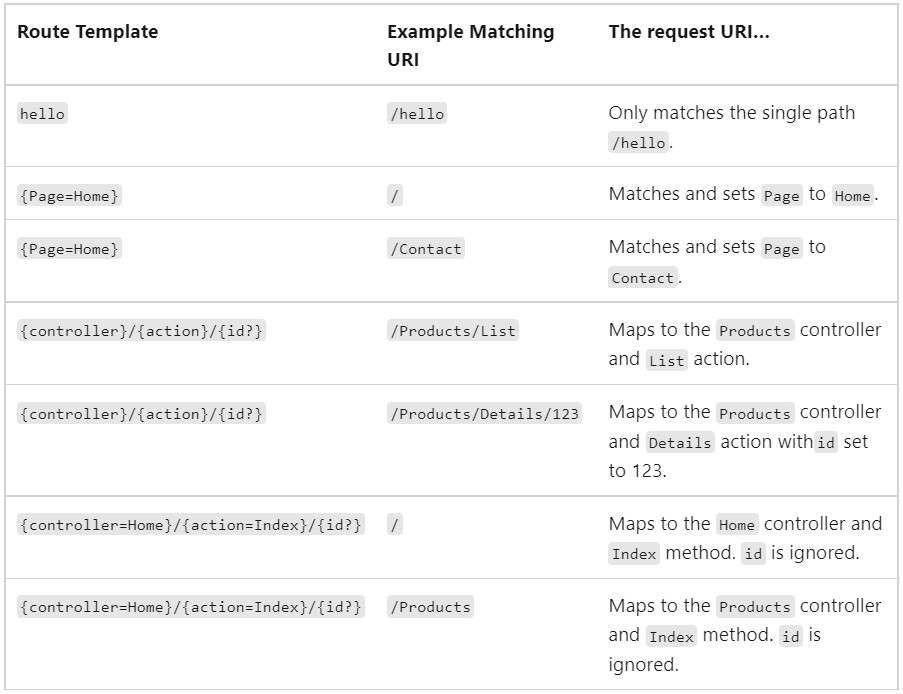

# Navigation Properties & Routing
---
## Routing in ASP.NET Core
Routing is responsible for matching incoming HTTP requests and dispatching those requests to the app's executable endpoints.
### Conventional Route
Startup.Configure typically has code similar to the following when using conventional routing:

```
app.UseEndpoints(endpoints =>
{
    endpoints.MapControllerRoute(
        name: "default",
        pattern: "{controller=Home}/{action=Index}/{id?}");
});
```

In this example, the route template will be "{controller=Home}/{action=Index}/{id?}". Matches a URL path like /Api/Rooms/5, so this is the default one provided when creating the controllers where the first two words represent the route, we will have our controller's name by tokenizing the path, that will access our database, and the last thing is the id so that we can have a specific row inside our table. 

---
### Endpoint
The MapGet method is used to define an endpoint. Endpoints that can be matched and executed by the app are configured in UseEndpoints. An endpoint is something that can be:

+ Selected, by matching the URL and HTTP method.
+ Executed, by running the delegate.

The following table demonstrates example route templates and their behavior when using the route template {controller}/{action}/{id?}.



Resource: [Microsoft-Docs](https://docs.microsoft.com/en-us/).

---

## Custom Route
We have an example for a route that returns a row by it's ID by sending a GET request with the path and controller's name followed by the ID. This method is inside our controller class. We can change the path so that we can have our custom route, for an example, we can have "api/Users/Rooms/3" or any other route but it should have a method that handels the request type and the task it's supposed to do.

```
[Route("api/[controller]")]
    [ApiController]
    public class HotelsController : ControllerBase 
    {
    // Any other methods that hanlde the routes.
    }
```


```
// GET: api/Hotels/5
        [HttpGet("{id}")]
        public async Task<ActionResult<Hotel>> GetHotel(int id) // GetHotel.
        {
            Hotel hotel = await _hotel.GetHotel(id);
            return Ok(hotel);
        }
```
